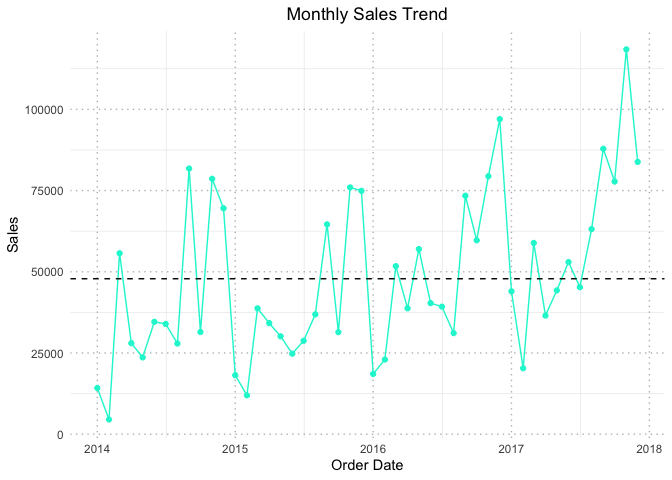

Superstore_project
================
2024-08-14

## Data info and cleaning

``` r
# Display the structure of the dataset
str(data)
```

    ## 'data.frame':    9994 obs. of  21 variables:
    ##  $ Row.ID       : int  1 2 3 4 5 6 7 8 9 10 ...
    ##  $ Order.ID     : chr  "CA-2016-152156" "CA-2016-152156" "CA-2016-138688" "US-2015-108966" ...
    ##  $ Order.Date   : chr  "11/8/2016" "11/8/2016" "6/12/2016" "10/11/2015" ...
    ##  $ Ship.Date    : chr  "11/11/2016" "11/11/2016" "6/16/2016" "10/18/2015" ...
    ##  $ Ship.Mode    : chr  "Second Class" "Second Class" "Second Class" "Standard Class" ...
    ##  $ Customer.ID  : chr  "CG-12520" "CG-12520" "DV-13045" "SO-20335" ...
    ##  $ Customer.Name: chr  "Claire Gute" "Claire Gute" "Darrin Van Huff" "Sean O'Donnell" ...
    ##  $ Segment      : chr  "Consumer" "Consumer" "Corporate" "Consumer" ...
    ##  $ Country      : chr  "United States" "United States" "United States" "United States" ...
    ##  $ City         : chr  "Henderson" "Henderson" "Los Angeles" "Fort Lauderdale" ...
    ##  $ State        : chr  "Kentucky" "Kentucky" "California" "Florida" ...
    ##  $ Postal.Code  : int  42420 42420 90036 33311 33311 90032 90032 90032 90032 90032 ...
    ##  $ Region       : chr  "South" "South" "West" "South" ...
    ##  $ Product.ID   : chr  "FUR-BO-10001798" "FUR-CH-10000454" "OFF-LA-10000240" "FUR-TA-10000577" ...
    ##  $ Category     : chr  "Furniture" "Furniture" "Office Supplies" "Furniture" ...
    ##  $ Sub.Category : chr  "Bookcases" "Chairs" "Labels" "Tables" ...
    ##  $ Product.Name : chr  "Bush Somerset Collection Bookcase" "Hon Deluxe Fabric Upholstered Stacking Chairs, Rounded Back" "Self-Adhesive Address Labels for Typewriters by Universal" "Bretford CR4500 Series Slim Rectangular Table" ...
    ##  $ Sales        : num  262 731.9 14.6 957.6 22.4 ...
    ##  $ Quantity     : int  2 3 2 5 2 7 4 6 3 5 ...
    ##  $ Discount     : num  0 0 0 0.45 0.2 0 0 0.2 0.2 0 ...
    ##  $ Profit       : num  41.91 219.58 6.87 -383.03 2.52 ...

``` r
# Get summary statistics for the dataset
summary(data)
```

    ##      Row.ID       Order.ID          Order.Date         Ship.Date        
    ##  Min.   :   1   Length:9994        Length:9994        Length:9994       
    ##  1st Qu.:2499   Class :character   Class :character   Class :character  
    ##  Median :4998   Mode  :character   Mode  :character   Mode  :character  
    ##  Mean   :4998                                                           
    ##  3rd Qu.:7496                                                           
    ##  Max.   :9994                                                           
    ##   Ship.Mode         Customer.ID        Customer.Name        Segment         
    ##  Length:9994        Length:9994        Length:9994        Length:9994       
    ##  Class :character   Class :character   Class :character   Class :character  
    ##  Mode  :character   Mode  :character   Mode  :character   Mode  :character  
    ##                                                                             
    ##                                                                             
    ##                                                                             
    ##    Country              City              State            Postal.Code   
    ##  Length:9994        Length:9994        Length:9994        Min.   : 1040  
    ##  Class :character   Class :character   Class :character   1st Qu.:23223  
    ##  Mode  :character   Mode  :character   Mode  :character   Median :56430  
    ##                                                           Mean   :55190  
    ##                                                           3rd Qu.:90008  
    ##                                                           Max.   :99301  
    ##     Region           Product.ID          Category         Sub.Category      
    ##  Length:9994        Length:9994        Length:9994        Length:9994       
    ##  Class :character   Class :character   Class :character   Class :character  
    ##  Mode  :character   Mode  :character   Mode  :character   Mode  :character  
    ##                                                                             
    ##                                                                             
    ##                                                                             
    ##  Product.Name           Sales              Quantity        Discount     
    ##  Length:9994        Min.   :    0.444   Min.   : 1.00   Min.   :0.0000  
    ##  Class :character   1st Qu.:   17.280   1st Qu.: 2.00   1st Qu.:0.0000  
    ##  Mode  :character   Median :   54.490   Median : 3.00   Median :0.2000  
    ##                     Mean   :  229.858   Mean   : 3.79   Mean   :0.1562  
    ##                     3rd Qu.:  209.940   3rd Qu.: 5.00   3rd Qu.:0.2000  
    ##                     Max.   :22638.480   Max.   :14.00   Max.   :0.8000  
    ##      Profit         
    ##  Min.   :-6599.978  
    ##  1st Qu.:    1.729  
    ##  Median :    8.666  
    ##  Mean   :   28.657  
    ##  3rd Qu.:   29.364  
    ##  Max.   : 8399.976

### Extra columns removal

``` r
# Drop columns Row ID, Order ID, Ship Date, Customer ID, Customer Name,Product ID,Country,Postal Code
data <- data[, !names(data) %in% c("Row.ID", "Order.ID","Ship.Date","Customer.ID", "Customer.Name", "Product.ID", "Country", "Postal Code")]
```

### Removal for duplicates and null variable

``` r
# Count missing values in each column
missing_counts <- colSums(is.na(data))
print(missing_counts)
```

    ##   Order.Date    Ship.Mode      Segment         City        State  Postal.Code 
    ##            0            0            0            0            0            0 
    ##       Region     Category Sub.Category Product.Name        Sales     Quantity 
    ##            0            0            0            0            0            0 
    ##     Discount       Profit 
    ##            0            0

``` r
# Identify duplicated rows and display them
duplicates <- data[duplicated(data), ]
print(duplicates)
```

    ##      Order.Date      Ship.Mode     Segment     City State Postal.Code Region
    ## 3407  4/23/2014 Standard Class Home Office Columbus  Ohio       43229   East
    ##       Category Sub.Category
    ## 3407 Furniture       Chairs
    ##                                                                         Product.Name
    ## 3407 Global Leather Highback Executive Chair with Pneumatic Height Adjustment, Black
    ##        Sales Quantity Discount   Profit
    ## 3407 281.372        2      0.3 -12.0588

``` r
# Remove subsequent duplicates while keeping the first occurrence
data <- data[!duplicated(data), ]

# Verify the dataset after removal
summary(data)
```

    ##   Order.Date         Ship.Mode           Segment              City          
    ##  Length:9993        Length:9993        Length:9993        Length:9993       
    ##  Class :character   Class :character   Class :character   Class :character  
    ##  Mode  :character   Mode  :character   Mode  :character   Mode  :character  
    ##                                                                             
    ##                                                                             
    ##                                                                             
    ##     State            Postal.Code       Region            Category        
    ##  Length:9993        Min.   : 1040   Length:9993        Length:9993       
    ##  Class :character   1st Qu.:23223   Class :character   Class :character  
    ##  Mode  :character   Median :56560   Mode  :character   Mode  :character  
    ##                     Mean   :55192                                        
    ##                     3rd Qu.:90008                                        
    ##                     Max.   :99301                                        
    ##  Sub.Category       Product.Name           Sales              Quantity    
    ##  Length:9993        Length:9993        Min.   :    0.444   Min.   : 1.00  
    ##  Class :character   Class :character   1st Qu.:   17.280   1st Qu.: 2.00  
    ##  Mode  :character   Mode  :character   Median :   54.480   Median : 3.00  
    ##                                        Mean   :  229.853   Mean   : 3.79  
    ##                                        3rd Qu.:  209.940   3rd Qu.: 5.00  
    ##                                        Max.   :22638.480   Max.   :14.00  
    ##     Discount          Profit         
    ##  Min.   :0.0000   Min.   :-6599.978  
    ##  1st Qu.:0.0000   1st Qu.:    1.731  
    ##  Median :0.2000   Median :    8.671  
    ##  Mean   :0.1562   Mean   :   28.661  
    ##  3rd Qu.:0.2000   3rd Qu.:   29.364  
    ##  Max.   :0.8000   Max.   : 8399.976

We can see that now the lenght of each variable has lowered by one,
meaning that the first istance has been kept while the subsequent
duplicate has been removed.

### Trend of Sales, Profits and Discounts

``` r
# Convert 'Order Date' to Date format
data$Order.Date <- mdy(data$Order.Date)
str(data$Order.Date)
```

    ##  Date[1:9993], format: "2016-11-08" "2016-11-08" "2016-06-12" "2015-10-11" "2015-10-11" ...

``` r
# Aggregate sales data by month
monthly_sales <- data %>%
  group_by(Month = floor_date(`Order.Date`, "month")) %>%
  summarise(Sales = sum(Sales))

monthly_discount <- data %>%
  group_by(Month = floor_date(`Order.Date`, "month")) %>%
  summarise(Discount = sum(Discount))

monthly_profit <- data %>%
  group_by(Month = floor_date(`Order.Date`, "month")) %>%
  summarise(Profit = sum(Profit))

# Calculate average values
avg_sales <- mean(monthly_sales$Sales)
avg_discount <- mean(monthly_discount$Discount)
avg_profit <- mean(monthly_profit$Profit)

# Aggregate sales data by year
yearly_sales <- data %>%
  group_by(Year = floor_date(`Order.Date`, "year")) %>%
  summarise(Sales = sum(Sales))

yearly_discount <- data %>%
  group_by(Year = floor_date(`Order.Date`, "year")) %>%
  summarise(Discount = sum(Discount))

yearly_profit <- data %>%
  group_by(Year = floor_date(`Order.Date`, "year")) %>%
  summarise(Profit = sum(Profit))

# Create the line plot for monthly sales
plot_monthly_sales <- ggplot(monthly_sales, aes(x = Month, y = Sales)) +
  geom_line(color = "#00F5D4") +  # Line color
  geom_point(color = "#00F5D4") +  # Marker color
  geom_hline(yintercept = avg_sales, color = "black", linetype = "dashed") +  # Add average sales line
  labs(title = "Monthly Sales Trend", x = "Order Date", y = "Sales") +  # Add titles and labels
  theme_minimal() +  # Use a minimal theme
  theme(panel.grid.major = element_line(color = "gray", linetype = "dotted"),
        plot.title = element_text(hjust = 0.5))  # Add grid lines

# Create the line plot for monthly discount 
plot_monthly_discount <- ggplot(monthly_discount, aes(x = Month, y = Discount)) +
  geom_line(color = "#FEE440") +  
  geom_point(color = "#FEE440") +  
  geom_hline(yintercept = avg_discount, color = "black", linetype = "dashed") +  
  labs(title = "Monthly Discount Trend", x = "Order Date", y = "Discount") +  
  theme_minimal() + 
  theme(panel.grid.major = element_line(color = "gray", linetype = "dotted"),
        plot.title = element_text(hjust = 0.5)) 

# Create the line plot for monthly profit
plot_monthly_profit <- ggplot(monthly_profit, aes(x = Month, y = Profit)) +
  geom_line(color = "#00BBF9") +  
  geom_point(color = "#00BBF9") +  
  geom_hline(yintercept = avg_profit, color = "black", linetype = "dashed") +  
  labs(title = "Monthly Profit Trend", x = "Order Date", y = "Profit") +
  theme_minimal() +  
  theme(panel.grid.major = element_line(color = "gray", linetype = "dotted"),
        plot.title = element_text(hjust = 0.5)) 

# Create the line plot for the yearly sales
plot_yearly_sales <- ggplot(yearly_sales, aes(x = Year, y = Sales)) +
  geom_line(color = "#00F5D4") +  # Line color
  geom_point(color = "#00F5D4") +  # Marker color
  labs(title = "Yearly Sales Trend", x = "Order Date", y = "Sales") +  # Add titles and labels
  theme_minimal() +  # Use a minimal theme
  theme(panel.grid.major = element_line(color = "gray", linetype = "dotted"),
        plot.title = element_text(hjust = 0.5))  # Add grid lines

# Create the line plot for the yearly disocount
plot_yearly_discount <- ggplot(yearly_discount, aes(x = Year, y = Discount)) +
  geom_line(color = "#FEE440") +  
  geom_point(color = "#FEE440") +  
  labs(title = "Yearly Discount Trend", x = "Order Date", y = "Discount") +  
  theme_minimal() + 
  theme(panel.grid.major = element_line(color = "gray", linetype = "dotted"),
        plot.title = element_text(hjust = 0.5)) 

# Create the line plot for the yearly profit
plot_yearly_profit <- ggplot(yearly_profit, aes(x = Year, y = Profit)) +
  geom_line(color = "#00BBF9") +  
  geom_point(color = "#00BBF9") +  
  labs(title = "Yearly Profit Trend", x = "Order Date", y = "Profit") +
  theme_minimal() +  
  theme(panel.grid.major = element_line(color = "gray", linetype = "dotted"),
        plot.title = element_text(hjust = 0.5)) 
```

<!-- --><!-- --><!-- --><!-- --><!-- --><!-- -->

From these graphs we could answer various business related questions.

1.  Which month had the highest monthly Sales, Discount and Profit?

The highest values for the three categories seems to be achieved in
November 2017

``` r
# Filter the dataset for November 2017 and summarize Sales, Discount, and Profit
november_2017_summary <- data %>%
  filter(format(Order.Date, "%Y-%m") == "2017-11") %>%
  summarise(
    November_2017_Sales = sum(Sales, na.rm = TRUE),
    November_2017_Discount = sum(Discount, na.rm = TRUE),
    November_2017_Profit = sum(Profit, na.rm = TRUE)
  )

# Display the result
print(november_2017_summary)
```

    ##   November_2017_Sales November_2017_Discount November_2017_Profit
    ## 1            118447.8                  73.89             9690.104

2.  Which month had the lowest monthly Sales, Discount and Profit?

- Lowest monthly Sales: February 2014
- Lowest monthly Discount: February 2016
- Lowest monthly Profit: January 2015 (Loss)

``` r
# Calculate Sales for February 2014
february_2014_sales <- data %>%
  filter(format(Order.Date, "%Y-%m") == "2014-02") %>%
  summarise(February_2014_Sales = sum(Sales, na.rm = TRUE))

# Calculate Discount for February 2016
february_2016_discount <- data %>%
  filter(format(Order.Date, "%Y-%m") == "2016-02") %>%
  summarise(February_2016_Discount = sum(Discount, na.rm = TRUE))

# Calculate Profit for January 2015
january_2015_profit <- data %>%
  filter(format(Order.Date, "%Y-%m") == "2015-01") %>%
  summarise(January_2015_Profit = sum(Profit, na.rm = TRUE))

# Combine all results into a single data frame
summary_results <- cbind(february_2014_sales, february_2016_discount, january_2015_profit)

# Display the combined result
print(summary_results)
```

    ##   February_2014_Sales February_2016_Discount January_2015_Profit
    ## 1            4519.892                      8           -3281.007

3.  Which year showed the most growth in Sales, Discount and Profit?

The year that showed the most growth it’s the year 2017

4.  What is monthly average of sales, Discount And Profit in 2015 and
    2017?

``` r
# Filter data for the years 2015 and 2017
data_2015_2017 <- data %>%
  filter(format(Order.Date, "%Y") %in% c("2015", "2017"))

# Group by year and month and then calculate monthly sums
monthly_summary <- data_2015_2017 %>%
  group_by(Year = format(Order.Date, "%Y"), Month = format(Order.Date, "%m")) %>%
  summarise(
    Total_Sales = sum(Sales, na.rm = TRUE),
    Total_Discount = sum(Discount, na.rm = TRUE),
    Total_Profit = sum(Profit, na.rm = TRUE)
  ) %>%
  ungroup()

# Calculate the monthly averages for each year
monthly_averages <- monthly_summary %>%
  group_by(Year) %>%
  summarise(
    Avg_Sales = mean(Total_Sales),
    Avg_Discount = mean(Total_Discount),
    Avg_Profit = mean(Total_Profit)
  )

# Display the monthly averages for 2015 and 2017
print(monthly_averages)
```

    ## # A tibble: 2 × 4
    ##   Year  Avg_Sales Avg_Discount Avg_Profit
    ##   <chr>     <dbl>        <dbl>      <dbl>
    ## 1 2015     39211.         27.3      5135.
    ## 2 2017     61101.         43.2      7787.

### Sales, Profits and Discounts by state

``` r
# Summarize the data by State for each metric
state_summary <- data %>%
  group_by(State) %>%
  summarise(
    Total_Sales = sum(Sales, na.rm = TRUE),
    Total_Profit = sum(Profit, na.rm = TRUE),
    Total_Discount = sum(Discount, na.rm = TRUE)
  )

# Bar plot for Sales by State (Flipped Axes, Reversed Order, and Formatted Y-Axis)
barplot_sales <- ggplot(state_summary, aes(x = fct_rev(State), y = Total_Sales)) +
  geom_bar(stat = "identity", fill = "#00F5D4", color = "black") +
  labs(title = "Total Sales by State", x = "State", y = "Sales") +
  theme_minimal() +
  coord_flip() +  # Flip the axes
  scale_y_continuous(labels = comma) +  # Format y-axis labels
  theme(axis.text.y = element_text(size = 8, hjust = 1),
        plot.title = element_text(hjust = 0.5))   # Adjust text size

# Bar plot for Profit by State 
barplot_profit <- ggplot(state_summary, aes(x = fct_rev(State), y = Total_Profit)) +
  geom_bar(stat = "identity", fill = "#00BBF9", color = "black") +
  labs(title = "Total Profits by State", x = "State", y = "Profits") +
  theme_minimal() +
  coord_flip() +  
  theme(axis.text.y = element_text(size = 8, hjust = 1),
        plot.title = element_text(hjust = 0.5)) 
 

# Bar plot for Discount by State 
barplot_discount <- ggplot(state_summary, aes(x = fct_rev(State), y = Total_Discount)) +
  geom_bar(stat = "identity", fill = "#FEE440", color = "black") +
  labs(title = "Total Discounts by State", x = "State", y = "Discounts") +
  theme_minimal() +
  coord_flip() +  
  theme(axis.text.y = element_text(size = 8, hjust = 1),
        plot.title = element_text(hjust = 0.5)) 
```

<!-- --><!-- --><!-- -->

#### Top 10 States by Sales, Profits and Discounts

``` r
# Filter the top 10 states by Sales, Profit, and Discount
top_10_sales <- state_summary %>% arrange(desc(Total_Sales)) %>% slice(1:10)
top_10_profit <- state_summary %>% arrange(desc(Total_Profit)) %>% slice(1:10)
top_10_discount <- state_summary %>% arrange(desc(Total_Discount)) %>% slice(1:10)

# Bar plot for Top 10 States by Sales
barplot_top_sales <- ggplot(top_10_sales, aes(x = fct_reorder(State, Total_Sales), y = Total_Sales)) +
  geom_bar(stat = "identity", fill = "#00F5D4", color = "black") +
  labs(title = "Top 10 States by Sales", x = "State", y = "Sales") +
  theme_minimal() +
  coord_flip() +  # Flip the axes
  scale_y_continuous(labels = comma) +  # Format y-axis labels
  theme(axis.text.y = element_text(size = 8, hjust = 1),
        plot.title = element_text(hjust = 0.5)) 
  # Adjust text size

# Bar plot for Top 10 States by Profit
barplot_top_profit <- ggplot(top_10_profit, aes(x = fct_reorder(State, Total_Profit), y = Total_Profit)) +
  geom_bar(stat = "identity", fill = "#00BBF9", color = "black") +
  labs(title = "Top 10 States by Profits", x = "State", y = "Profits") +
  theme_minimal() +
  coord_flip() +  
  scale_y_continuous(labels = comma) +  
  theme(axis.text.y = element_text(size = 8, hjust = 1),
        plot.title = element_text(hjust = 0.5)) 
  

# Bar plot for Top 10 States by Discount
barplot_top_discount <- ggplot(top_10_discount, aes(x = fct_reorder(State, Total_Discount), y = Total_Discount)) +
  geom_bar(stat = "identity", fill = "#FEE440", color = "black") +
  labs(title = "Top 10 States by Discounts", x = "State", y = "Discounts") +
  theme_minimal() +
  coord_flip() +  
  scale_y_continuous(labels = comma) + 
  theme(axis.text.y = element_text(size = 8, hjust = 1),
        plot.title = element_text(hjust = 0.5)) 
```

<!-- --><!-- --><!-- -->

General Conclusions from the Graphs:

- High Sales vs. Profitability: States with the highest total sales
  (like Texas and California) don’t necessarily have the highest
  profits. In fact, Texas, despite having the highest sales, is
  experiencing significant losses, likely due to the substantial
  discounts offered. This suggests that high sales alone don’t guarantee
  profitability; effective cost management and pricing strategies are
  crucial.

- Impact of Discounts: There appears to be a correlation between high
  discounts and lower profitability. States that offer significant
  discounts (e.g., Texas and Tennessee) tend to have lower profits or
  even losses, indicating that excessive discounting might erode profit
  margins. Conversely, states with moderate discounts (e.g., California
  and New York) tend to show better profitability, suggesting a more
  balanced and effective use of discounts.

- Profit Outliers: States like California and New York, which are among
  the highest in terms of profit, have found a sweet spot between
  offering discounts and maintaining profitability. They manage to
  generate significant sales without overly relying on discounts,
  resulting in substantial profits.

- Low Sales and Profitability: States with low total sales generally
  show low profits as well, which is expected. However, if these states
  also have low discounts, it might suggest that their sales volumes are
  too low to cover fixed costs, or that they might need to reconsider
  their pricing or marketing strategies to improve sales.

- Sales and Profit Distribution: The data suggests a wide disparity in
  sales and profitability across states. A few states dominate in terms
  of both sales and profit, while many others lag significantly behind.
  This could indicate market saturation in top-performing states or
  untapped potential in underperforming ones.

Strategic Insights:

- Balancing Discounts and Profit: Excessive discounting does not always
  lead to better financial outcomes. States that carefully balance
  discounts while focusing on driving sales through other means (e.g.,
  better marketing, customer loyalty programs) tend to perform better in
  terms of profitability.

- Focus on Underperforming States: States with low sales and profits
  might benefit from targeted strategies to boost market presence and
  customer engagement. This could involve tailored promotions, localized
  marketing campaigns, or reassessing product offerings to better meet
  local demand.

- Leverage High-Performing States: States that are already performing
  well in terms of both sales and profit could serve as models for
  strategies that could be applied to other regions. Understanding what
  drives success in these states could help in replicating that success
  elsewhere.

#### Top 10 Cities by Sales, Profits and Discounts

``` r
# Summarize the data by Cities for each metric
cities_summary <- data %>%
  group_by(City) %>%
  summarise(
    Total_Sales = sum(Sales, na.rm = TRUE),
    Total_Profit = sum(Profit, na.rm = TRUE),
    Total_Discount = sum(Discount, na.rm = TRUE)
  )

# Filter the top 10 Cities by Sales, Profit, and Discount
top_10_cities_sales <- cities_summary %>% arrange(desc(Total_Sales)) %>% slice(1:10)
top_10_cities_profit <- cities_summary %>% arrange(desc(Total_Profit)) %>% slice(1:10)
top_10_cities_discount <- cities_summary %>% arrange(desc(Total_Discount)) %>% slice(1:10)

# Bar plot for Top 10 States by Sales
barplot_top_city_sales <- ggplot(top_10_cities_sales, aes(x = fct_reorder(City, Total_Sales), y = Total_Sales)) +
  geom_bar(stat = "identity", fill = "#00F5D4", color = "black") +
  labs(title = "Top 10 Cities by Sales", x = "City", y = "Sales") +
  theme_minimal() +
  coord_flip() +  # Flip the axes
  scale_y_continuous(labels = comma) +  # Format y-axis labels
  theme(axis.text.y = element_text(size = 8, hjust = 1),
        plot.title = element_text(hjust = 0.5)) # Adjust text size

# Bar plot for Top 10 States by Profit
barplot_top_city_profit <- ggplot(top_10_cities_profit, aes(x = fct_reorder(City, Total_Profit), y = Total_Profit)) +
  geom_bar(stat = "identity", fill = "#00BBF9", color = "black") +
  labs(title = "Top 10 Cities by Profits", x = "City", y = "Profits") +
  theme_minimal() +
  coord_flip() +  
  scale_y_continuous(labels = comma) +  
  theme(axis.text.y = element_text(size = 8, hjust = 1),
        plot.title = element_text(hjust = 0.5)) 

# Bar plot for Top 10 States by Discount
barplot_top_city_discount <- ggplot(top_10_cities_discount, aes(x = fct_reorder(City, Total_Discount), y = Total_Discount)) +
  geom_bar(stat = "identity", fill = "#FEE440", color = "black") +
  labs(title = "Top 10 Cities by Discounts", x = "City", y = "Discounts") +
  theme_minimal() +
  coord_flip() +  
  scale_y_continuous(labels = comma) + 
  theme(axis.text.y = element_text(size = 8, hjust = 1),
        plot.title = element_text(hjust = 0.5)) 
```

<!-- --><!-- --><!-- -->

### Other visualizations

#### Count of Category and Sub-category

``` r
#Count the occurrences of each category
category_counts <- data %>%
  count(Category) %>%
  arrange(desc(n))

#Count the occurrences of each sub-category
subcategory_counts <- data %>%
  count(Sub.Category) %>%
  arrange(desc(n))

#Create the category barplot
category_barplot <- ggplot(category_counts, aes(x = reorder(Category, -n), y = n)) +
  geom_bar(stat = "identity", fill = "steelblue") +  # Create bar plot
  labs(title = "Category Counts", x = "Category", y = "Count") +  # Add titles and labels
  theme_minimal() +  # Use a minimal theme
  theme(axis.text.x = element_text(angle = 45, hjust = 1),
        plot.title = element_text(hjust = 0.5)) # Rotate x-axis labels for readability

#Create the sub-category barplot
subcategory_barplot <- ggplot(subcategory_counts, aes(x = reorder(Sub.Category, -n), y = n)) +
  geom_bar(stat = "identity", fill = "steelblue") + 
  labs(title = "Sub-category Counts", x = "Sub-category", y = "Count") +
  theme_minimal() + 
  theme(axis.text.x = element_text(angle = 45, hjust = 1),
        plot.title = element_text(hjust = 0.5)) 
```

<!-- -->

#### Distribution of Shipments

``` r
#Calculate the counts and percentages of Ship Mode
ship_mode_counts <- data %>%
  count(Ship.Mode) %>%
  mutate(Percentage = n / sum(n) * 100)

# Step 2: Create the pie chart
pie_chart <- ggplot(ship_mode_counts, aes(x = "", y = Percentage, fill = Ship.Mode)) +
  geom_bar(stat = "identity", width = 1) +
  coord_polar(theta = "y") +
  labs(title = "Distribution of Ship Mode", fill = "Ship Mode") +
  theme_void() +  # Remove background, grids, and axis lines
  theme( plot.title = element_text(hjust = 0.5)) +
  geom_text(aes(label = paste0(round(Percentage, 1), "%")),
            position = position_stack(vjust = 0.5)) +  # Add percentage labels inside the pie slices
  scale_fill_manual(values = c("#007d7c", "#a6cee3", "#1f78b4", "#b2df8a", "#33a02c", "#fb9a99", "#e31a1c"))  #Define custom colors
```

<!-- -->

#### Count and Distribution of Customer Segment

``` r
# Calculate the counts of the Segment variable
segment_counts <- data %>%
  count(Segment)

# Create a color palette with the right number of colors
num_segments <- nrow(segment_counts)
colors <- scales::hue_pal()(num_segments)

# Create the pie chart for Segment
pie_chart_segment <- ggplot(segment_counts, aes(x = "", y = n, fill = Segment)) +
  geom_bar(width = 1, stat = "identity") +
  coord_polar(theta = "y") +
  theme_void() +  # Clean background and remove axis labels
  geom_text(aes(label = paste0(round(n / sum(n) * 100, 1), "%")),
            position = position_stack(vjust = 0.5)) +  # Add percentage labels
  scale_fill_manual(values = colors)  # Dynamically generated colors

# Create the bar chart for Segment
bar_chart_segment <- ggplot(segment_counts, aes(x = Segment, y = n, fill = Segment)) +
  geom_bar(stat = "identity", color = "black") +
  geom_text(aes(label = n), vjust = -0.3, size = 4) +  # Add values on top of the bars
  labs(y = "Count", x = "Segment") +
  theme_minimal() +
  scale_fill_manual(values = colors) +  # Use the same dynamic color palette
  theme(legend.position = "none")  # Remove the legend
```

<!-- -->

#### Words Cloud of Product names

``` r
# Convert 'Product.Name' column to UTF-8 encoding
data$Product.Name <- iconv(data$Product.Name, from = "latin1", to = "UTF-8")

# Convert the Product.Name column to a vector of words
product_names <- tolower(data$Product.Name)  # Convert to lowercase
product_names <- removePunctuation(product_names)  # Remove punctuation
product_names <- removeNumbers(product_names)  # Remove numbers
product_names <- stripWhitespace(product_names)  # Remove extra whitespace

# Create a corpus and a term-document matrix
corpus <- Corpus(VectorSource(product_names))
tdm <- TermDocumentMatrix(corpus)
matrix <- as.matrix(tdm)
word_freqs <- sort(rowSums(matrix), decreasing=TRUE)
df_word_freqs <- data.frame(word = names(word_freqs), freq = word_freqs)
```

<div class="wordcloud2 html-widget html-fill-item" id="htmlwidget-46821b2bdb82ac07ab6c" style="width:672px;height:480px;"></div>
<script type="application/json" data-for="htmlwidget-46821b2bdb82ac07ab6c">{"x":{"word":["xerox","with","avery","for","binders","chair","black","phone","gbc","binder","ring","binding","file","global","newell","and","eldon","paper","envelopes","covers","series","usb","table","fellowes","white","acco","round","recycled","pencil","system","storage","wilson","wireless","hon","outlet","wall","personal","clock","plastic","message","desk","surge","box","jones","chairs","frame","logitech","drive","pack","steel","electric","office","executive","mouse","labels","conference","keyboard","sharpener","wood","stacking","book","tables","per","blue","task","headset","shelving","accessories","belkin","bookcases","safco","pencils","back","collection","shelf","standard","hanging","digital","data","portable","poly","wire","leather","finish","mobile","scissors","case","letter","acme","dax","computer","protector","boston","heavyduty","staple","premium","gray","lamp","ibico","printer","voip","clips","wirebound","tenex","pressboard","class","size","clear","mini","holder","deluxe","books","managers","commercial","tennsco","machine","air","plantronics","micro","colored","telephone","card","folder","copier","manual","highlighters","color","set","advantus","cover","panasonic","samsung","pro","vacuum","capacity","systems","flash","locking","diameter","pile","business","iphone","folding","star","metal","bookcase","bush","hepa","power","osullivan","highback","gaming","ultra","memorex","staples","bluetooth","line","howard","miller","document","cardinal","medium","laser","contemporary","fabric","sheets","adjustable","hooks","pockets","impressions","colors","upright","cart","cherry","rings","cisco","pocket","mat","oic","durable","bevis","fluorescent","desktop","rectangular","room","combs","galaxy","replacement","drawer","page","cleaner","travel","mats","door","top","oak","low","vinyl","sets","post","docubind","tops","filter","push","kensington","adams","dual","att","envelope","forms","peel","sanford","kit","value","cards","maxell","opener","files","lockers","arms","printout","easystaple","dixon","four","selfadhesive","universal","chromcraft","hard","sandisk","plus","corded","holmes","dark","drawers","filing","flexible","deflecto","center","professional","steno","premier","expressions","the","memory","tote","light","cubicle","transparent","burgundy","hoover","stordrawer","tilter","model","base","chalk","swivel","strips","design","bands","sauder","perma","master","soft","industrial","bright","slantd","report","bulbs","assorted","tab","hole","hot","frames","comb","super","pins","carpets","cordless","library","polycom","arm","seel","letterlegal","protection","surgemaster","southworth","messages","stainless","posts","accohide","view","chrome","apple","charger","sony","floor","ergonomic","mesh","poster","stackable","prang","studded","canon","large","panel","lite","eureka","pad","end","bankers","dring"," flash","custom","speaker","aluminum","punch","rubber","halogen","photo","natural","presentation","suppressor","carina","brown","typewriters","bretford","foot","ezd","cotton","bic","brite","liner","masterpiece","lid","highlighter","pine","loop","double","easel","memo","flex","dubllock","carbonless","compact","rogers","square","media","stand","spiral","mount","storex","sharpeners","smoke","bluray","disc","recordable","first","sectional","heavy","caster","ticonderoga","legal","novimex","chairmats","seth","thomas","crayola","expandable","note","antistatic","swiveltilt","tool","label","motorola","matrix","guardian","cubes","lamps","upholstered","designer","carpeting","anker","button","advantage","elements","proclick","mega","superior","stop","combo","imation gb","red","organizer","single","pen","space","microsoft","keepers","grip","trays","usb flash","datatraveler","kingston","velobind","audio","charcoal","atlantic","metals","elite","presstex","economy","index","wired","classic","microsdhc","htc","one","carton","metallic","numbers","ampad","velobinder","holdit","use","verbatim","addon","cline","stick","homeoffice","luxo","creations","magnifier","slant","belts","nortel","copy","nonstick","drive ","contoured","tabs","prepunched","ink","oval","sound","surround","forged","sheet","car","booster","signal","home","spa","strip","midback","granite","multipurpose","thermabind","erasable","pads","speakerphone","honeywell","interoffice","bullnose","imprintable","armless","rollaway","officeware","ear","coffee","duo","print","protectors","high","jabra","chisel","tip","yellow","green","were","you","multiuse","bags","hewlett","packard","cruzer","rediform","mac","nudell","over","razer","handles","dvdr","iceberg","chairmat","traveldrive","string","electrix","hunt","style","lip","padded","tyvek","project","hello","kitty","binney","smith","amp","training","easy","dimensions","living","image","corner","stack","layer","bin","cube","racetrack","kxtgb","out","while","screen","vac","regeneration","westfield","floodlight","pagoda","twin","hiliter","solid","dot","colorcoded","bins","misc","tensor","folders","refrigerator","stylus","beige","ruled","cubic","port","fiskars","prestige","key","solutions","accent","head","instant","height","sand","mahogany","router","reader","remover","sdhc","magazine","extra","big","rack","duty","cable","battery","otterbox","lifters","stereo","adjustableheight","external","passport","ghz","beveled","shuttle","front","boltless","watts","dmi","dura","long","strathmore","lowback","towers","elliptical","acrylic","split","dana","wdividersspace","securitytint","bar","bases","gueststacker","enamel","ibimaster","lesro","reinforcements","cdr","diagonal","gould","plastics","longerlife","carts","sizes","adapter","handle","click","vault","hangings","staplebased","enviracaire","gold","automatic","band","angled","holders","rolling","commerce","sterilite","boss","enermax","compartment","jet","units","starter","grain","zipper","regency","harbour","vtech","purifier","tie","swing","hidden","traditional","dividers","decoflex","barrister","multifunction","scrolling","web","westinghouse","scanner","staxonsteel","rechargeable","clearvue","xtralife","situations","cases","seat","tripp","monaural","armband","bottom","profile","slim","angleview","dxl","clampon","accessory","multimedia","clip","plain","colorific","mah","control","odessa","disposable","bulb","lined","pattern","wave","hangers","meridian"," keyboard ","ebony","alphabetical","carry","electronics","multitask","contract","ideas","neat","jumbo","printers","workstation","performance","kraken","permanent","assembled","fully","furniture","iii","pages","punched","minute","catalog","advanced","olson","stacker","khaki","trimmed","tub","level","twotone","okidata","mitel","sixoutlet","riverside","royal","brushed","manager","powerhouse","numeric","arco","blackgray","expanding"," speaker","closure","tray","netgear","aastra","mid","call","insertable","ream","saver","balt","everyday","swingarm","turn","andora","maplegraphite","magnetic","smead","programmable","woodtone","zboost","scooter","froggy","shaped","log","carbon","cup","tsw","function","rounded","sturdstor","leatherlike","turbo","service","avaya","encrypted","hardware","comfort","depth","gregg","coated","indoor","faber","polyproplyene","imageclass","wifi","spines","credit","brush","command","wide","floors","bevel","economat","zebra","alliance","speak","textured","flow","overthehead","ledgersize","pianohinge","unit","fax","doubletier","cool","revere","camden","county","face","flat","impact","basic","duramat","trapezoid","side","softgrip","lexmark","faxphone","tmobile","inktank","stanley","two","arturo","missionstyle","sharp","clipon","gooseneck","life","remote","spag","barrel","hinged","hitech","translucent","pyle","suede","comet","screw","dust","trackball","nonfolding","utility","amplipower","geemarc","boxed","canvas","invitation","filtration","drawing","tube","avanti","certificate","photos","polaroid","satellite","silver","samsill","very","parchment","speed","carpet","refrigerators","mailers","topopening","scoop","greenpink","hybrid","needs","silicone","sanitaire","shredder","adjustment","pneumatic","navy","equipment","vented","sculpt","clustermat","handifile","watercolor","gallon","century","molded","general","continuousfeed","eaton","shtsbox","lightning","bind","uchannel","grandstream","gxp","gauge","magnifying","pewter","mighty","alphaz","pmpled","magnet","binaural","full","usb headset  headset ","things","today","gear","prismacolor","blank","lock","stockwell","iris","arch","soundpoint","windtunnel","defender","multidevice","rca","planmaster","planked","load","harmony","stools","unburst","cut","plymouth","grayclear","pkg","twister","staxonsteelhighstak","centers","lendline","address","cord","length","faxmobile","section","heavyweight","cleatmat","astro","keypad","lumia","nokia","meeting","chest","indigo","logitech pe","quartet","neon","goldtone","stuff","tuff","spine","bulldog","allinone","incandescent","wdubllock","troy","carpeted","storm","pearl","premiere","isotel","doorstop","mist","clearsounds","baked","mate","airflow","bindings","supplies","sheffield","order","special","receipt","shoulder","insert","stripsextra","legs","mivoice","kpbk","digium","interactive","composition","hewlettpackard","inkjet","xrack","marble","trackman","guard","ranger","markers","visys","smartsocket","drafting","conference phone","shark","channel","answering","rapid","dirt","singlewidth","branded","way","corelock","griffin","duratech","frosted","active","crayons","seam","handset","platinum","dazzle","wiper","dustless","sticks","simplifile","logitech gaming","clamps","ideal","liquid","bulk","fibre","simplefile","backings","velcro","laserjet","flap","gummed","grabber","odor","adhesive","transfer","assistive","filestacking","pink","handheld","boxes","great","singletier","tall","hinge","reinforced","reel","tape","clearone","kraft","easyopen","buff","cameo","policy","unified","wallmount","music","cutter","savers","highstak","commuter","setsbook","lettertrim","perforations","voyager","dataprinter","dvdrw","ativa","brother","iptsd","ip telephone","toshiba","bestar","binderpad","performers","holepunch","mounted","logic","diamond","walnut","rugby","surelock","sensible","wiretech","batteryoperated","energy","innovations","jambox","jawbone","mmo","maxell lto","ultrium","synchro","tilt","marathon","vvx","storall","counter","nontoxic","incomingoutgoing","register","spinevue","clamp","polarizing","clairmont","fourcolor","apc","network","surgearrest","rosewoodblack","hand","selfstanding","albany","heritage","fold","roll","fcvtel","flexiview","kxts","array","nettalk","snapaway","association","blind","central","writing","flip","redistrip","globe","weis","snapon","travlfile","sanyo","international","monochrome","wihtout","microcut","bostitch","wfrequentlycalled","omega","deep","shelves","colerase","school","gigabit","addressshipping","scratch","rigid","tufvin","removable","crateafiles","designed","ergonomically","knee","purpose","showcase","heavierduty","geo","strictly","mylar","reinforcing","titanium","gloss","martinyale","pin","giant","résumé","bio","imation","imation corp","solids","bionaire","clasp","ipad","polypropylene","lifetime","tiamat","linden","logitech mx","lockup","spelbinder","hypercom","pinpad","thick","fine","without","important","checking","invisibleshield","smudgefree","zagg","dcp","anti","extenders","soho","plate","stringtie","officeworks","orange","clean","china","peeloff","savi","voice","manor","float","straight","libraries","mediabridge","sport","forest","hills","woodland","charcoalnickeltone","imation clip","nickelplated","store","multisize","security","trimmers","woodline","drylighter","manco","glass","earset","mxi","dect","manger","plasticlear","eberhard","golf","weight","slimview","cubix","earpieces headset","encore","patternclear","shears","major","calculator","iottie","bre","puttywoodgrain","lumber","triplicate","sortfiler","logitech ls","lead","look","copierlaser","lighweight","convenience","packs","cordless phone","headset with","inline","volume","jbl","imation secure","numerals","twocolor","telescoping","soft”","“pillow","specialty","pizazz","quick","foundations","graycharcoal","practical","everbold","xbase","american","shade","coloredge","woodgrain","mobuis","mission","doors","lbs","part","perf","gobal","chadless","martin","yale","printable","repositionable","grantwood","zazzle","cush","purple","rugged","sos","architect","helium","juice","mophie","inc","broadband","modemfax","tlpnet","airmail","antibacterial","tagit","linen","archival","bound","datapak","printouts","amplified","csc","spirit","logitech illuminated","nautilus","direct","discs","oriole","ridgewood","networks","envelopesset","rsvp","boatshaped","rollamat","pebble","magna","picture","visual","delta","triangular","acrylux","charging","innergie","mmini","clearchat","comfortusb","pedestal","diskette","alder","facets","sky","hour","radial","alarm","distant","time","traveler","amplifier","signalboost","liqua","day","humidifier","output","its","stickers","deskjet","casebound","hinges","trolley","daydate","quietcare","pull","ibm","slotted","quicksnap","spacemaker","framed","eclipse","suite","europro","cellular","wiex","imation secure drive ","faxmodem","money","nesting","kus","mouseinabox","tsb","open","snaptogether","format","desert","blackberry","organizers","flags","map","pennant","tacks","arb","hardfloor","recessed","openers","expert","optical","hierlooms","rush","barricks","dupl","formspg","average","keytronic eu","akro","action","bldv","decker","dustbuster","smearsafe","triangle","astroparche","bent","comfortask","taskswivel","auxiliary","lcm","vertical","lawyers","palais","royale","architects","seal","companion","antique","laid","lenovo","body","bravo","megaboss","adtran","clampmount","puregear","rollon","sideopening","bagged","bose","soundlink","touch","bpi","zoomin","trimline","castell","“snap”","gigabit smart","contico","window","epson","drive usb flash","dock","ihome","radio","folddown","aurora","tpin","coat","isound","steppededge","rosebrook","second","sideload","fgvgry","chalkboard","eraser","ultrathin","phonefaxmodem","combination","welded","unikeep","acb","acoustics","cyber","recognition","speech","filingposting","stapleon","skin","orbit","ehavfwe","¾”","spindle","grade","avoid","minifold","orders","verbal","formpg","messagesbk","hang","cell","ikross","selfstacking","inglewood","choice","lasercopy","weyerhaeuser","multicolor","integrated","pbx","ipodiphoneipadipad","qvs","heighadjustable","internet","modem","trendnet","three","career","selfseal","briskie","driver","edition headset","supreme","column","elevations","ultraslim","convertible"," headset ","park","fuchsia","sportfit","ampli","dataproducts","spigen","wallet","datawarehouse","mobius","operators","dinovo","edge","multipro","indexes","angle","degree","rubbermaid","kleencut","logitech vx","notebooks","revolution","landvery","plantations","hammermill","cribbage","optional","workspace","google","nexus","motivational","caller","idcall","waiting","employee","month","embossed","contour","granitelook","shape","cdn","containers","offs","show","spectator","putty","blackfrost","secure","voicestation","rediletter","speediset","name","ooma","telo","payanywhere","earth","kleen","clasps","copper","riverleaf","stikwithit","enterprise","seating","ltweight","vacs","drive gb","imation ","amazonbasics","texas","scientific","hlcrio","boards","melamine","bonded","lightweight","somerset","conference phone ","konftel","jetpak","trimflex","candyshell","products","speck","midsize","puttycolored","biz","corded headset","mxdhe","coloring","count","eraseable","trw","linenfinish","cycle","contur","hub","sabrent","small","unpunched","supertray","unbreakable","graintextured","akromils","pcf","alcs","hightech","ultimate","supervisor","divider","hbs","tone","heightadjustable","time”","work","“just","snips","regal","chat","communications","oc speaker","portapower","cubex","cubify","laminate","extraheavyweight","manila","cherrywood","estates","mite","chatattach","nano","notebook","receiver","slimblade","clarity","thermalthermal","preferred","fsv","keypads","micropad","evidence","wirebond","ups","powergen","wvelcro","dsl","apsco","crayon","display","gameboard","lcd","bluetooth headset with","bxt","parrot","valutask","extended","house","whole","ames","border","colorfile","xray","shorephone","shoretel","gge","ball","arkon","dashboard","vent","windshield","conquest","kpabk","sideloading","mainstream","ethernet","extender","startechcom","vdsl","brianna","hill","belt","guardsman","blackstonian","vista","bady","bdgfru","soundstation","quality","motorla","purifiers","quiet","gallery","receipts","snapoff","pizzaz","springaction","woodmetal","macally","suction","calisto","berol","thermal","flipchart","anywhere","blacksilver","cordedcordless","casters","crates","ultracompact","connectors","earpods","mic","fourpocket","supersize","tuning","stiletto","triplefilter","droid","maxx","columnar","conventional","sidepunched","dvd","blade","serrated","dolby","technology","sleeves","brentwood","fastcharging","jackery","generation","adaptabilities","maxi","racks","jensen","smps","logitech z","sys","theater","centerweighted","linenstyle","torchiere","track","tree","memosize","steamvac","lifter","turquoise","artistic","instaplaque","kld","oscar","synthetic","thin","rosewood","boxoffice","halfmoon","terminal","video","free","jam","swingline","uniblazer","write","slideclip","sketching","candy","sheer","pointe","fruitwood","imation usb","swivel flash","glasstique","synj","jack","splitter","safety","occasional","humidifiervaporizer","warm","plinth","leatherette","gxt","dvdram","best","aus","art","legend","foldable","micronics","tsp","shocksock","geographics","tankstyle","fashion","cornerstone","cardscan","dymo","crimson","canister","cash","petty","short","pastel","lockable","brites","outlets","form","phonefax","greeting","rest","skilcraft","handfinished","auto","astrobrights","papers","wausau","cedar","maple","holiday","disk","keytronic ktp","copyplus","keytronic ktu","standup","fmv","flourescent","watt","vtre","varicap","periboardb","perixx","bluelounge","milo","smartphone","whitemetallic","powershred","keys","normal","rosewill","chairman","exalt","ip phone g","voip phone ","epk","designjet","asst","mead","buttonstring","stanwyck","bdhkiphbk","dilex","holster","seidio","canary","nonstudded","thumbtacks","earthwrite","device","smartstand","euro","dexim","superthin","xpower","imàge","ecotones","instruments","crisper","steelblack","lunatik","strike","taktik","ttl","empty","collector","ricoh","galleria","powerjolt","galvanized","hersey","kiss","styled","wchampagne","groomer","vibra","message”","postit","sheetspad","“important","arc","structures","marknet","server","keytronic ","workforce","fastfit","qode","small office","telephone ","xblue","cartridge","maxell ivdr","exhibit","alpha","vmdd","reuseaseal","tspiiu","cute","owl","sannysis","cabinet","lockerfile","econostor","machines","cpg","station","slimline","loose","omniview","rackmount","mail","gluetop","antique telephone zl","ivory","panelpartition","moto","scented","dell","tmtv","adaptabilites","cherrystorm","italian","squared","indooroutdoor","anderson","conga","hickey","econocleat","erasers","mdm","imation swivel flash","rolls","slitter","curved","kickplate","ultrasonic","visible","rich","accuwave","additional","magenta","thermaabind","corporation","united","fraction","instrument","convoy","glidestik","hardbound","out”","“while","slips","unpadded","plum","eallinone","officejet","portfile","boombox","logitech wireless","tmfd","borderless","consecutively","numbered","ezmount","weighted","circular","movement","quartz","sterling","envpack","invitations","party","dispenser","highvolume","workcentre","mfcdw","triple","smart","tenoutlet","ccd","code","wasp","hanover","saratoga","home telephone","prt","retro","jiffy","iriscard","telepresence","videoconferencing","perfection","birmingham","backlighting","illuminated","ridge","collaboration","experience","pny","glide","hre","business telephones kxt","chs","socket","xiaomi","closer","valve","konica","magicolor","minolta","neatdesk","job","stride","led","mfccdw","gkt","rangemax","wnr","desktjet","refurbished","sixcolor","tsplan","area","duplicate","reply","penpower","worldcard","bagless","graphiteblack"],"freq":[865,588,557,539,524,478,425,349,342,340,337,333,329,289,276,258,251,245,238,236,235,231,230,230,220,218,213,210,206,203,195,194,194,190,186,186,186,184,182,182,181,180,179,178,174,170,170,166,165,163,159,158,153,149,148,146,146,142,141,137,136,134,133,131,130,130,126,125,123,123,121,121,120,118,118,118,113,113,111,110,107,106,105,104,104,100,98,98,98,98,97,96,95,95,95,94,93,92,92,92,90,90,90,88,87,87,87,87,86,86,84,84,82,82,82,81,81,81,81,81,80,79,79,79,79,78,78,78,77,77,76,76,75,75,74,73,73,72,72,72,72,71,71,71,70,67,67,67,67,67,66,66,65,65,65,65,65,64,64,64,64,63,63,63,62,62,62,61,61,61,60,60,59,59,59,59,59,59,59,58,58,58,58,57,57,57,57,56,56,56,55,55,55,55,55,54,54,54,53,53,53,53,52,52,52,52,52,51,51,51,50,50,50,49,49,49,48,48,47,47,47,46,46,46,45,45,45,45,45,45,45,43,43,43,43,43,43,43,43,43,43,42,42,42,42,42,41,41,41,41,40,40,39,39,39,39,39,39,39,39,39,39,38,38,38,38,38,37,37,37,37,37,37,36,36,36,36,36,36,36,35,35,35,35,35,35,35,35,35,35,34,34,34,34,34,34,34,34,34,33,33,33,33,32,32,32,32,32,32,32,32,31,31,31,31,31,31,31,31,31,31,31,31,31,30,30,30,30,30,30,30,30,30,30,30,30,30,30,30,30,30,29,29,29,29,29,29,29,29,29,28,28,28,28,28,28,28,28,28,28,28,28,27,27,27,27,27,27,27,27,27,27,27,27,27,27,27,27,26,26,26,26,26,26,26,26,26,26,26,26,25,25,25,25,25,25,25,25,25,25,25,25,25,25,25,24,24,24,24,24,24,24,24,24,24,24,24,24,24,24,24,24,24,23,23,23,23,23,23,23,23,23,23,23,23,23,23,23,23,23,23,23,23,23,23,23,23,23,23,23,23,22,22,22,22,22,22,22,22,22,22,22,22,22,22,22,22,22,22,21,21,21,21,21,21,21,21,21,21,21,21,21,21,21,21,21,21,21,21,21,21,21,21,21,20,20,20,20,20,20,20,20,20,20,20,20,20,20,20,20,20,20,20,20,20,19,19,19,19,19,19,19,19,19,19,19,19,19,19,19,19,19,19,19,19,19,19,19,18,18,18,18,18,18,18,18,18,18,18,18,18,18,18,18,18,18,18,18,18,18,18,18,18,18,18,18,18,18,18,18,17,17,17,17,17,17,17,17,17,17,17,17,17,17,17,17,17,17,17,17,17,17,17,17,17,17,16,16,16,16,16,16,16,16,16,16,16,16,16,16,16,16,16,16,16,16,16,16,16,16,16,16,16,16,16,16,16,16,16,15,15,15,15,15,15,15,15,15,15,15,15,15,15,15,15,15,15,15,15,15,15,15,15,14,14,14,14,14,14,14,14,14,14,14,14,14,14,14,14,14,14,14,14,14,14,14,14,14,14,14,14,14,14,14,14,14,14,14,14,14,14,14,14,14,14,14,14,14,14,14,14,14,14,14,13,13,13,13,13,13,13,13,13,13,13,13,13,13,13,13,13,13,13,13,13,13,13,13,13,13,13,13,13,13,13,13,13,13,13,13,13,13,13,13,12,12,12,12,12,12,12,12,12,12,12,12,12,12,12,12,12,12,12,12,12,12,12,12,12,12,12,12,12,12,12,12,12,12,12,12,12,12,12,12,12,12,12,11,11,11,11,11,11,11,11,11,11,11,11,11,11,11,11,11,11,11,11,11,11,11,11,11,11,11,11,11,11,11,11,11,11,11,11,11,11,11,11,11,11,11,11,11,10,10,10,10,10,10,10,10,10,10,10,10,10,10,10,10,10,10,10,10,10,10,10,10,10,10,10,10,10,10,10,10,10,10,10,10,10,10,10,10,10,10,10,10,10,10,10,10,10,10,10,10,10,10,10,10,10,10,10,10,10,10,10,10,10,10,10,10,10,10,10,10,10,10,9,9,9,9,9,9,9,9,9,9,9,9,9,9,9,9,9,9,9,9,9,9,9,9,9,9,9,9,9,9,9,9,9,9,9,9,9,9,9,9,9,9,9,9,9,9,9,9,9,9,9,9,9,9,9,9,9,9,9,9,9,9,9,9,9,9,9,9,9,9,9,9,9,9,8,8,8,8,8,8,8,8,8,8,8,8,8,8,8,8,8,8,8,8,8,8,8,8,8,8,8,8,8,8,8,8,8,8,8,8,8,8,8,8,8,8,8,8,8,8,8,8,8,8,8,8,8,8,8,8,8,8,8,8,8,8,8,8,8,8,8,8,8,8,8,8,8,8,8,8,8,8,8,8,8,8,8,8,8,8,8,8,8,8,8,8,8,8,8,8,8,8,8,8,8,8,8,8,8,8,7,7,7,7,7,7,7,7,7,7,7,7,7,7,7,7,7,7,7,7,7,7,7,7,7,7,7,7,7,7,7,7,7,7,7,7,7,7,7,7,7,7,7,7,7,7,7,7,7,7,7,7,7,7,7,7,7,7,7,7,7,7,7,7,7,7,7,7,7,7,7,7,7,7,7,7,7,7,7,7,7,7,7,7,7,7,7,7,7,7,7,7,7,7,7,7,7,7,7,7,7,7,7,7,7,7,7,7,7,7,7,7,7,7,7,7,7,7,7,7,7,7,7,7,7,7,7,7,6,6,6,6,6,6,6,6,6,6,6,6,6,6,6,6,6,6,6,6,6,6,6,6,6,6,6,6,6,6,6,6,6,6,6,6,6,6,6,6,6,6,6,6,6,6,6,6,6,6,6,6,6,6,6,6,6,6,6,6,6,6,6,6,6,6,6,6,6,6,6,6,6,6,6,6,6,6,6,6,6,6,6,6,6,6,6,6,6,6,6,6,6,6,6,6,6,6,6,6,6,6,6,6,6,6,6,6,6,6,6,6,6,6,6,6,6,6,6,6,6,6,6,6,6,6,6,6,6,6,6,6,6,6,6,6,6,6,6,6,6,6,6,6,6,6,6,6,6,6,6,6,6,6,6,6,6,6,6,6,6,6,6,6,6,6,6,6,6,6,6,6,6,5,5,5,5,5,5,5,5,5,5,5,5,5,5,5,5,5,5,5,5,5,5,5,5,5,5,5,5,5,5,5,5,5,5,5,5,5,5,5,5,5,5,5,5,5,5,5,5,5,5,5,5,5,5,5,5,5,5,5,5,5,5,5,5,5,5,5,5,5,5,5,5,5,5,5,5,5,5,5,5,5,5,5,5,5,5,5,5,5,5,5,5,5,5,5,5,5,5,5,5,5,5,5,5,5,5,5,5,5,5,5,5,5,5,5,5,5,5,5,5,5,5,5,5,5,5,5,5,5,5,5,5,5,5,5,5,5,5,5,5,5,5,5,5,5,5,5,5,5,5,5,5,5,5,5,5,5,5,5,5,5,5,5,5,5,5,5,5,5,5,5,5,5,5,4,4,4,4,4,4,4,4,4,4,4,4,4,4,4,4,4,4,4,4,4,4,4,4,4,4,4,4,4,4,4,4,4,4,4,4,4,4,4,4,4,4,4,4,4,4,4,4,4,4,4,4,4,4,4,4,4,4,4,4,4,4,4,4,4,4,4,4,4,4,4,4,4,4,4,4,4,4,4,4,4,4,4,4,4,4,4,4,4,4,4,4,4,4,4,4,4,4,4,4,4,4,4,4,4,4,4,4,4,4,4,4,4,4,4,4,4,4,4,4,4,4,4,4,4,4,4,4,4,4,4,4,4,4,4,4,4,4,4,4,4,4,4,4,4,4,4,4,4,4,4,4,4,4,4,4,4,4,4,4,4,4,4,4,4,4,4,4,4,4,4,4,3,3,3,3,3,3,3,3,3,3,3,3,3,3,3,3,3,3,3,3,3,3,3,3,3,3,3,3,3,3,3,3,3,3,3,3,3,3,3,3,3,3,3,3,3,3,3,3,3,3,3,3,3,3,3,3,3,3,3,3,3,3,3,3,3,3,3,3,3,3,3,3,3,3,3,3,3,3,3,3,3,3,3,3,3,3,3,3,3,3,3,3,3,3,3,3,3,3,3,3,3,3,3,3,3,3,3,3,3,3,3,3,3,3,3,3,3,3,3,3,3,3,3,3,3,3,3,3,3,3,3,3,3,3,3,3,3,2,2,2,2,2,2,2,2,2,2,2,2,2,2,2,2,2,2,2,2,2,2,2,2,2,2,2,2,2,2,2,2,2,2,2,2,2,2,2,2,2,2,2,2,2,2,2,2,2,2,2,2,2,2,2,2,2,2,2,2,2,2,2,2,2,2,2,2,2,2,2,2,2,2,2,2,2,2,2,2,2,2,2,2,2,2,2,2,2,2,2,2,2,2,2,2,2,2,2,2,1,1,1,1,1,1,1,1,1,1,1,1,1,1,1,1,1,1,1,1,1,1,1,1,1,1,1,1,1,1,1,1,1,1,1,1,1,1,1,1,1,1,1,1,1,1,1,1,1,1,1,1,1,1,1,1],"fontFamily":"Segoe UI","fontWeight":"bold","color":"random-light","minSize":0,"weightFactor":0.3121387283236994,"backgroundColor":"white","gridSize":0,"minRotation":-0.7853981633974483,"maxRotation":0.7853981633974483,"shuffle":true,"rotateRatio":0.4,"shape":"circle","ellipticity":0.65,"figBase64":null,"hover":null},"evals":[],"jsHooks":{"render":[{"code":"function(el,x){\n                        console.log(123);\n                        if(!iii){\n                          window.location.reload();\n                          iii = False;\n\n                        }\n  }","data":null}]}}</script>
